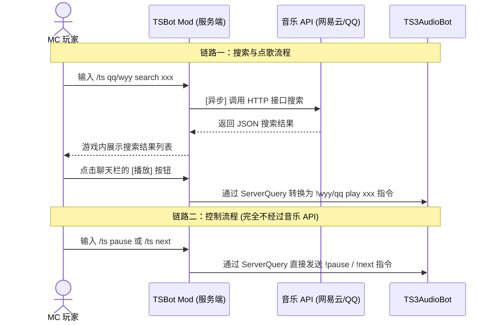

# TSBot Mod — Minecraft × TeamSpeak 3 跨平台点歌联动

<p align="center">
  
  
  
  
</p>

> **TSBot Mod** 是一个基于 Minecraft Forge 的服务端模组。它致力于打破游戏与语音软件的壁垒，让玩家在 MC 游戏内即可通过聊天指令，直接搜索、播放和控制 TeamSpeak 3 频道中的音乐机器人，实现「MC 点歌 → TS3 播放」的丝滑体验。

⚠️ **写在前面**：本项目最初为满足作者个人服务器需求而开发，内部架构较为复杂且功能仍在迭代中。部分极端场景下可能存在 Bug，欢迎通过 Issues 提交反馈或 PR 协助完善。

---

## 💡 项目背景与原理

许多硬核游戏社区习惯同时使用 Minecraft 服务器与 TeamSpeak 3 进行语音沟通。借助优秀的 [TS3AudioBot](https://github.com/Splamy/TS3AudioBot) 及其插件，TS3 频道本身已具备强大的点歌能力。

**痛点在于**：玩家每次点歌、切歌都必须 `Alt + Tab` 切换到 TS3 客户端，严重打断游戏沉浸感。

**解决方案**：TSBot Mod 作为桥梁，将玩家在 MC 聊天栏内的交互，精准分发给音乐 API（获取数据）或 TS3 ServerQuery（执行播放），玩家完全无需离开游戏界面。

### 核心工作流

> [!WARNING]
> **⚠️ 使用该模组前必须完全理解以下架构逻辑：**

本模组在底层将指令分为**“搜索点歌”**与**“基础控制”**两条独立的数据链路：



---

## 🏗️ 技术架构与设计要点

### 💡 核心设计亮点

* **🚀 完全异步 (Non-blocking)**：这是本 Mod 最核心的性能保障。所有涉及调用音乐 API 的网络 I/O 操作，全部采用 `CompletableFuture` 异步执行，**绝不阻塞 Minecraft 主线程**，即使 API 响应慢也完全不会拉低服务器的 TPS。
* **🔌 极简的控制流**：如上图所示，对于单纯的控制指令（如切歌、暂停），模组会直接通过 ServerQuery 与 TS3 通信，避免了多余的 API 请求开销。
* **⚙️ TS3 协议深度兼容**：没有依赖臃肿的第三方库，而是从底层完整实现了 ServerQuery 的转义规则、Welcome Banner 消耗机制以及严格的键值对认证流程。
* **🛡️ 健壮的容错机制**：针对连接超时、认证失败、API 宕机或空配置等异常场景，均做了完备的异常捕获，并会在游戏内给玩家明确的报错反馈。

### 模块概览

| 核心类名 | 核心职责 |
| :--- | :--- |
| `TSBotMod` | Forge Mod 入口，Brigadier 命令树注册，接收玩家指令 |
| `MusicSearchService` | 异步 HTTP 搜索实现，负责调用网易云 / QQ 音乐 API 并解析结果 |
| `PlayQueue` | 播放队列管理，区分“立即播放”与“入队”，并负责向全服广播通知 |
| `TS3QueryClient` | TS3 ServerQuery 协议底层客户端实现，负责发送 `!play` / `!next` 等指令 |

---

## ⚠️ 核心前置依赖

> [!IMPORTANT]
> TSBot Mod 仅仅是指令的“搬运工”，实际的播放能力依赖以下项目，请**务必先行完成部署**。

1. **[TS3AudioBot-Plugin-Netease-QQ](https://github.com/RayQuantum/TS3AudioBot-Plugin-Netease-QQ) （核心播放引擎）**
   * 由 @RayQuantum 开发的优秀插件。支持双平台播放、VIP 歌曲登录、歌词与多种播放模式。
   * **部署指北**：推荐使用 Docker 部署，详见其官方 README。
2. **[TS3AudioBot](https://github.com/Splamy/TS3AudioBot)**
   * TS3 音频机器人底层框架，上述插件的运行载体。
3. **音乐 API 服务（双端共用）**
   * [网易云音乐 API (默认端口 3000)](https://github.com/Binaryify/NeteaseCloudMusicApi)
   * [QQ 音乐 API (默认端口 3300)](https://github.com/jsososo/QQMusicApi)

---

## ✨ 功能特性

* 🔍 **双源搜索**：支持网易云 / QQ 音乐关键词搜索，结果在 MC 聊天栏以交互式文本展示。
* ▶️ **快捷交互**：搜索结果自带 `[播放]` 与 `[入队]` 悬浮按钮，点击即播。
* ⏭ **基础控制**：支持 `/ts next` (切歌) 与 `/ts pause` (暂停/继续)。
* 📢 **全服广播**：玩家点歌、切歌时，触发全服动态通知（包含操作者与歌名），氛围感拉满。
* ⚙️ **开箱即用**：首次启动自动生成带注释的 `tsbot-config.toml`。
* 🔓 **无权限门槛**：无需 OP 权限，全体在线玩家均可使用。

---

## 🚀 部署指南 (服主向)

### 1. 安装 Mod
前往 [Releases](https://github.com/CharyeahOwO/TSBot-Mod/releases) 下载最新版 `tsbotmod-x.x.x.jar`，放入 Minecraft 服务端的 `mods/` 文件夹并启动一次服务器。

### 2. 修改配置
服务器启动后会生成 `config/tsbot-config.toml` 文件，请根据实际情况配置：

```toml
[General]
# TS3 ServerQuery 连接信息
host = "your-ts3-server.com"       # TS3 服务器 IP/域名
port = 10011                       # ServerQuery 端口 (默认 10011)
user = "serveradmin"               # 管理员账号
password = "YOUR_PASSWORD"         # ⚠️ 注意：这是 Query 密码，非频道密码！

# 默认音乐源 (wyy 或 qq)
default_source = "wyy"

# 音乐 API 地址 (需包含 http:// 且不带尾斜杠)
netease_api = "[http://127.0.0.1:3000](http://127.0.0.1:3000)"
qq_api = "[http://127.0.0.1:3300](http://127.0.0.1:3300)"
```

### 3. 验证连接
保存配置后重启服务端，若控制台输出以下内容，则代表连接成功：
```log
[TSBotMod] TSBotMod V2.0 已加载，等待服务器指令。
[TSBotMod]   TS3 服务器连接就绪...
[TSBotMod]   网易云 API: 正常接入
[TSBotMod]   QQ音乐 API: 正常接入
```

---

## 🛠️ 从源码构建 (开发者向)

环境要求：**JDK 17** (必须)

```bash
git clone [https://github.com/CharyeahOwO/TSBot-Mod.git](https://github.com/CharyeahOwO/TSBot-Mod.git)
cd TSBot-Mod
# Linux / macOS
JAVA_HOME=/path/to/jdk17 ./gradlew build
# Windows
gradlew build -Dorg.gradle.java.home="C:\path\to\jdk17"
```
构建产物位于 `build/libs/` 目录下。

> [!WARNING]
> 切勿使用 JDK 21 或更高版本进行编译，否则会导致 Forge 加载时抛出 `Unsupported class file major version 65` 异常。

---

## 📖 指令参考词典

| 指令语法 | 功能说明 | 使用示例 |
| :--- | :--- | :--- |
| `/ts wyy search <关键词>` | 搜索网易云音乐 | `/ts wyy search 晴天` |
| `/ts qq search <关键词>` | 搜索 QQ 音乐 | `/ts qq search 七里香` |
| `/ts wyy play <ID>` | 立即播放 (网易云) | 直接点击搜索结果的 `[播放]` |
| `/ts wyy add <ID>` | 加入队列 (网易云) | 直接点击搜索结果的 `[入队]` |
| `/ts next` | 切换下一首 | `/ts next` |
| `/ts pause` | 暂停 / 继续播放 | `/ts pause` |

*注：上述 MC 指令在后台会被解析为 `!wyy play` 等原生 TS3 机器人指令，并通过 ServerQuery 发送执行。*

---

## 🐛 常见排错指南

* **Q: 为什么 TS3 日志疯狂报错 `invalid loginname or password`？**
  * A: 配置文件里的 `password` 填错了。ServerQuery 密码是在 TS3 服务端**首次初始化**时生成在控制台的，如果你忘记了，可能需要重置 TS3 服务端的数据库或者使用相关脚本重新生成。
* **Q: 搜索功能正常，点击播放没反应/没声音？**
  * A: 本 Mod 只负责发送指令。请检查你部署的 TS3AudioBot 以及 Netease-QQ 插件是否正常工作，机器人是否在你的频道里，以及机器人本身是否有播放权限。
* **Q: QQ 音乐搜索结果一直为空？**
  * A: 请检查你的 QQ 音乐 API 容器状态，可以在服务器后台用 `curl http://你的IP:3300/search?key=测试` 看看有没有 JSON 数据返回。

---

## 🙏 致谢

本项目的实现站在了巨人的肩膀上，特别感谢以下开源项目与社区：

- 🌟 [TS3AudioBot-Plugin-Netease-QQ](https://github.com/RayQuantum/TS3AudioBot-Plugin-Netease-QQ) (by @RayQuantum) — 提供了核心的播放解析能力。
- [Splamy/TS3AudioBot](https://github.com/Splamy/TS3AudioBot)
- [Binaryify/NeteaseCloudMusicApi](https://github.com/Binaryify/NeteaseCloudMusicApi)
- [jsososo/QQMusicApi](https://github.com/jsososo/QQMusicApi)
- [Minecraft Forge](https://minecraftforge.net/) 

*(本 README 初稿由 Claude Opus 4.6 生成并经人工润色校对，如有问题欢迎提交 Issues)*

---

## 📄 License

All Rights Reserved. See [LICENSE.txt](LICENSE.txt).
