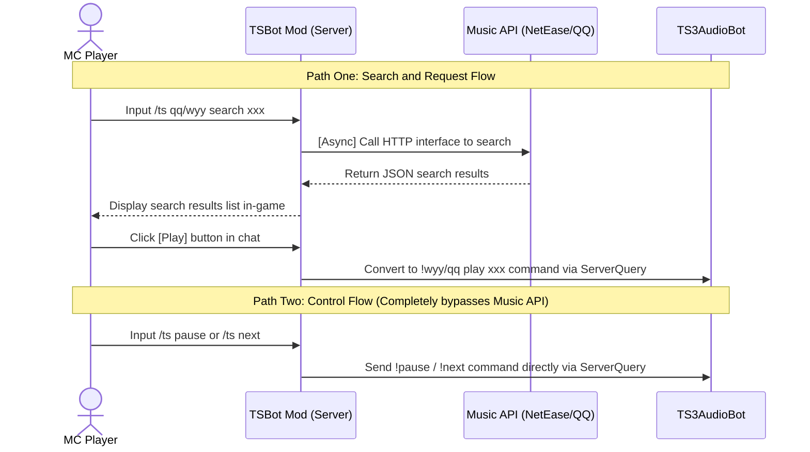

# TSBot Mod — Minecraft × TeamSpeak 3 Cross-Platform Music Integration

<p align="center">
  
  
  
  
</p>

> **TSBot Mod** is a Minecraft Forge server-side mod. It aims to break down the barriers between games and voice software, allowing players to search, play, and control music bots in TeamSpeak 3 channels directly through chat commands in MC, achieving a seamless "MC Request → TS3 Playback" experience.

⚠️ **Disclaimer**: This project was initially developed to meet the author's personal server needs. The internal architecture is relatively complex and features are still being iterated. There may be bugs in some extreme scenarios. Feedback via Issues or PRs to help improve the project is welcome.

---
## 📸 Demo

| Minecraft In-Game Interaction (Request/Skip) | TeamSpeak 3 Bot Response |
| :---: | :---: |
|  |  |
| *Players search and click play in chat* | *Bot plays music synchronously, displaying cover and info* |

## 🔔 Core Prerequisites (Must Read Before Deployment)

> [!IMPORTANT]
> **This mod essentially serves as an "MC-side extended control client" for the following projects, acting merely as a "command transporter." Before using this mod, please ensure you have fully met all the following conditions, otherwise this mod will have no practical effect.**

### 🚫 Important Warning: Hard Requirements for TS3 Server
This mod strongly depends on TeamSpeak 3's **ServerQuery port (default 10011)** and an account with corresponding execution permissions (such as `serveradmin`).
**If you are using cheap shared servers or channel servers purchased from Taobao or other channels, merchants usually do not provide ServerQuery permissions. In this case, this mod absolutely cannot be used!** Please ensure you have full underlying control of the TS3 server (recommended to use an independent VPS to build your own TS3 server).

### 🛠️ Required Prerequisites
1. **Core Playback Engine: [TS3AudioBot-Plugin-Netease-QQ](https://github.com/RayQuantum/TS3AudioBot-Plugin-Netease-QQ)**
   * An excellent TS3 music plugin developed by @RayQuantum. Supports NetEase Cloud Music/QQ Music dual-platform playback, VIP song login, lyrics, and multiple playback modes.
   * All playback commands sent by TSBot Mod (such as `!wyy play`, etc.) are ultimately executed by this plugin on the TeamSpeak 3 side.
   * **Deployment Recommendation**: Recommended to deploy using Docker, see its official README for details.
2. **Underlying Bot Framework: [TS3AudioBot](https://github.com/Splamy/TS3AudioBot)**
   * The underlying runtime carrier for TeamSpeak 3 audio bots.
3. **Music API Services (Shared by Both Ends)**
   * [NetEase Cloud Music API (default port 3000)](https://github.com/Binaryify/NeteaseCloudMusicApi)
   * [QQ Music API (default port 3300)](https://github.com/jsososo/QQMusicApi)

---

## 💡 Project Background and Principles

Many hardcore gaming communities are accustomed to using both Minecraft servers and TeamSpeak 3 for voice communication. With the above TS3 plugin, channels already have powerful music request capabilities.

**The Pain Point**: Players must `Alt + Tab` to switch to the TS3 client every time they want to request or skip songs, severely interrupting game immersion.

**The Solution**: TSBot Mod acts as a bridge, precisely distributing player interactions in the MC chat bar to music APIs (to get data) or TS3 ServerQuery (to execute playback), allowing players to completely stay within the game interface.

### Core Workflow

> [!WARNING]
> **⚠️ You must fully understand the following architectural logic before using this mod:**

This mod divides commands into two independent data paths at the underlying level: **"Search and Request"** and **"Basic Control"**:



---

## 🏗️ Technical Architecture and Design Highlights

### 💡 Core Design Highlights

* **🚀 Fully Asynchronous (Non-blocking)**: This is the most core performance guarantee of this Mod. All network I/O operations involving calls to music APIs are executed asynchronously using `CompletableFuture`, **absolutely never blocking the Minecraft main thread**. Even if the API responds slowly, it will not affect the server's TPS at all.
* **🔌 Minimal Control Flow**: As shown in the diagram above, for simple control commands (such as skip, pause), the mod directly communicates with TS3 through ServerQuery, avoiding unnecessary API request overhead.
* **⚙️ Deep TS3 Protocol Compatibility**: Instead of relying on bloated third-party libraries, it fully implements ServerQuery's escape rules, Welcome Banner consumption mechanism, and strict key-value pair authentication process from the bottom up.
* **🛡️ Robust Error Handling**: Complete exception handling for connection timeouts, authentication failures, API downtime, or empty configurations, with clear error feedback to players in-game.

### Module Overview

| Core Class Name | Core Responsibility |
| :--- | :--- |
| `TSBotMod` | Forge Mod entry point, Brigadier command tree registration, receives player commands |
| `MusicSearchService` | Asynchronous HTTP search implementation, responsible for calling NetEase / QQ Music APIs and parsing results |
| `PlayQueue` | Playback queue management, distinguishes "play immediately" and "enqueue", and is responsible for broadcasting notifications to the entire server |
| `TS3QueryClient` | TS3 ServerQuery protocol underlying client implementation, responsible for sending `!play` / `!next` and other commands |

---

## ✨ Features

* 🔍 **Dual-Source Search**: Supports NetEase Cloud Music / QQ Music keyword search, results displayed as interactive text in MC chat.
* ▶️ **Quick Interaction**: Search results come with `[Play]` and `[Enqueue]` hover buttons, click to play.
* ⏭ **Basic Control**: Supports `/ts next` (skip) and `/ts pause` (pause/resume).
* 📢 **Server-Wide Broadcast**: When players request or skip songs, triggers server-wide dynamic notifications (including operator and song name), creating a great atmosphere.
* ⚙️ **Out-of-the-Box**: Automatically generates annotated `tsbot-config.toml` on first launch.
* 🔓 **No Permission Barrier**: No OP permissions required, all online players can use it.

---

## 🚀 Deployment Guide (For Server Owners)

> **Prerequisites**: Please ensure all services in the above [Core Prerequisites] are running, and **you have TS3 ServerQuery permissions**, before installing this mod.

### 1. Install Mod
Go to [Releases](https://github.com/CharyeahOwO/TSBot-Mod/releases) to download the latest `tsbotmod-x.x.x.jar`, place it in the Minecraft server's `mods/` folder and start the server once.

### 2. Modify Configuration
After the server starts, it will generate a `config/tsbot-config.toml` file. Please configure according to your actual situation:

```toml
[General]
# TS3 ServerQuery connection information
host = "your-ts3-server.com"       # TS3 server IP/domain
port = 10011                       # ServerQuery port (default 10011)
user = "serveradmin"               # Administrator account
password = "YOUR_PASSWORD"         # ⚠️ Note: This is the Query password, not the channel password!

# Default music source (wyy or qq)
default_source = "wyy"

# Music API addresses (must include http:// and no trailing slash)
netease_api = "http://127.0.0.1:3000"
qq_api = "http://127.0.0.1:3300"
```

### 3. Verify Connection
After saving the configuration, restart the server. If the console outputs the following content, it means the connection is successful:
```log
[TSBotMod] TSBotMod V2.0 loaded, waiting for server commands.
[TSBotMod]   TS3 server connection ready...
[TSBotMod]   NetEase API: Connected normally
[TSBotMod]   QQ Music API: Connected normally
```

---

## 🛠️ Building from Source (For Developers)

Environment Requirements: **JDK 17** (Required)

```bash
git clone https://github.com/CharyeahOwO/TSBot-Mod.git
cd TSBot-Mod
# Linux / macOS
JAVA_HOME=/path/to/jdk17 ./gradlew build
# Windows
gradlew build -Dorg.gradle.java.home="C:\path\to\jdk17"
```
Build artifacts are located in the `build/libs/` directory.

> [!WARNING]
> Do not use JDK 21 or higher for compilation, otherwise it will cause Forge to throw an `Unsupported class file major version 65` exception during loading.

---

## 📖 Command Reference

| Command Syntax | Function | Usage Example |
| :--- | :--- | :--- |
| `/ts wyy search <keyword>` | Search NetEase Cloud Music | `/ts wyy search Sunny Day` |
| `/ts qq search <keyword>` | Search QQ Music | `/ts qq search Qi Li Xiang` |
| `/ts wyy play <ID>` | Play immediately (NetEase) | Click `[Play]` on search results directly |
| `/ts wyy add <ID>` | Add to queue (NetEase) | Click `[Enqueue]` on search results directly |
| `/ts next` | Skip to next song | `/ts next` |
| `/ts pause` | Pause / Resume playback | `/ts pause` |

*Note: The above MC commands are parsed into native TS3 bot commands such as `!wyy play` in the background and sent for execution via ServerQuery.*

---

## 🐛 Troubleshooting Guide

* **Q: Why does the console report an error unable to connect to ServerQuery or port 10011?**
  * A: First check if your TS3 server firewall/security group has allowed port 10011 (TCP). Second, **if you are using a shared TS3 channel server purchased from Taobao for tens of dollars, merchants will not give you ServerQuery permissions and ports. This situation has no solution. Please rent a VPS to build your own TS3.**
* **Q: Why does TS3 log keep reporting `invalid loginname or password` errors?**
  * A: The `password` in the configuration file is incorrect. The ServerQuery password is generated in the console when the TS3 server is **first initialized**. If you forgot it, you may need to reset the TS3 server database or use related scripts to regenerate it.
* **Q: Search works fine, but clicking play has no response/no sound?**
  * A: This Mod only sends commands. Please check if your deployed TS3AudioBot and Netease-QQ plugin are working normally, if the bot is in your channel, and if the bot itself has playback permissions.
* **Q: QQ Music search results are always empty?**
  * A: Please check your QQ Music API container status. You can use `curl http://your-IP:3300/search?key=test` in the server background to see if there is JSON data returned.

---

## 🙏 Acknowledgments

This project stands on the shoulders of giants. Special thanks to the following open-source projects and communities:

- 🌟 [TS3AudioBot-Plugin-Netease-QQ](https://github.com/RayQuantum/TS3AudioBot-Plugin-Netease-QQ) (by @RayQuantum) — Provides core playback parsing capabilities.
- [Splamy/TS3AudioBot](https://github.com/Splamy/TS3AudioBot)
- [Binaryify/NeteaseCloudMusicApi](https://github.com/Binaryify/NeteaseCloudMusicApi)
- [jsososo/QQMusicApi](https://github.com/jsososo/QQMusicApi)
- [Minecraft Forge](https://minecraftforge.net/) 

*(This README was initially generated by Claude Opus 4.6 and manually polished and proofread. If you have any issues, please submit Issues)*

---

## Final Notes

This project is for learning and exchange purposes only, and does not involve any commercial use. If you have any questions or suggestions, please provide feedback through [Issues](https://github.com/CharyeahOwO/TSBot-Mod/issues)
If the project becomes popular, we will consider making an official version, including Paper version and Fabric
However, it's so niche that it probably won't become popular

## 📄 License

All Rights Reserved. See [LICENSE.txt](LICENSE.txt).

